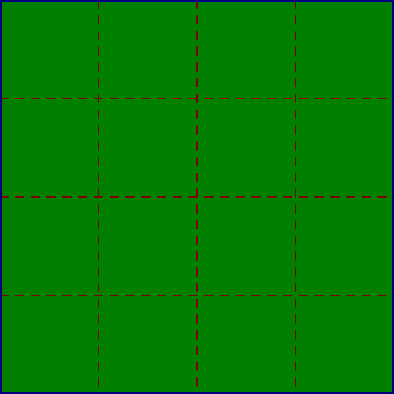
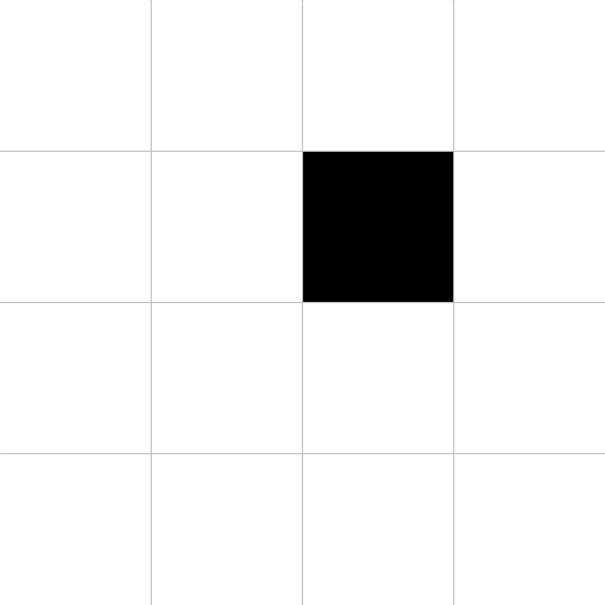
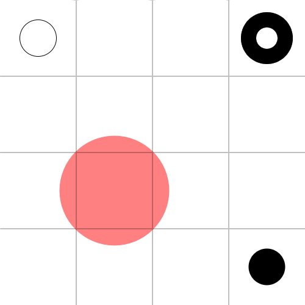
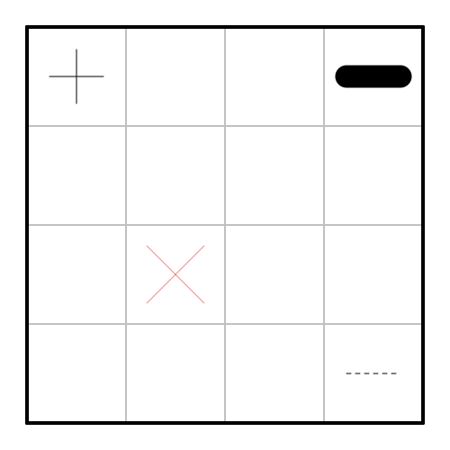
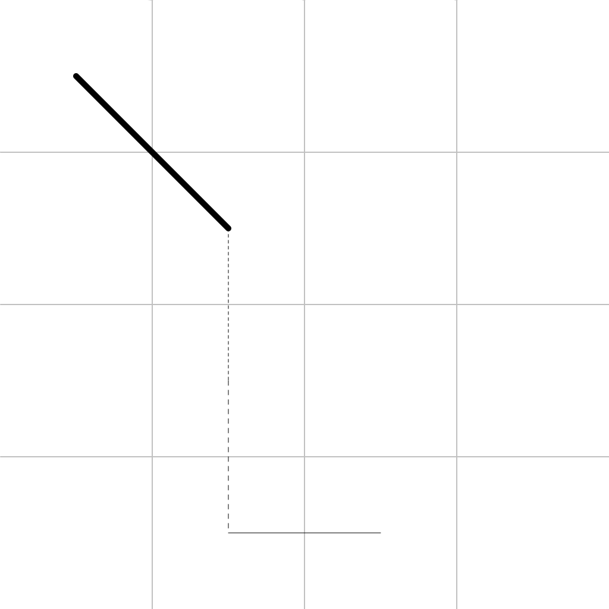
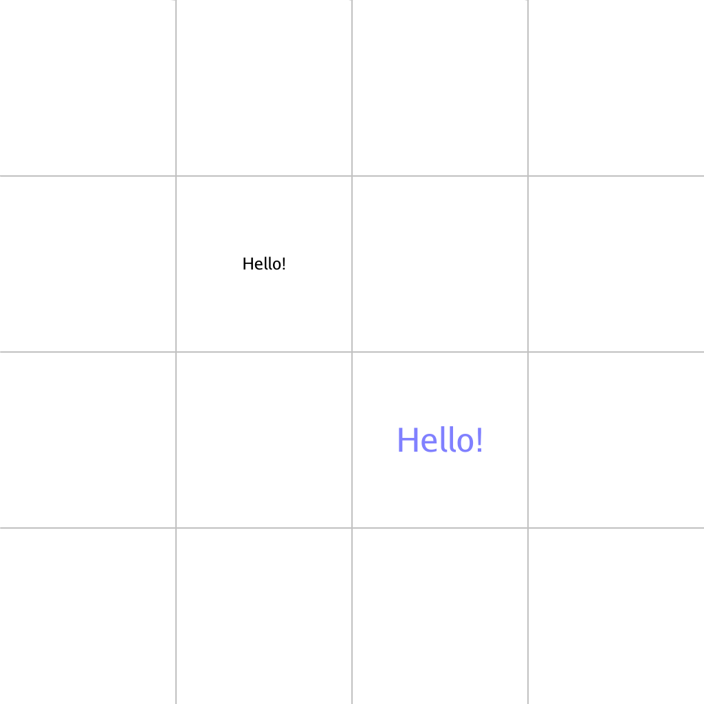
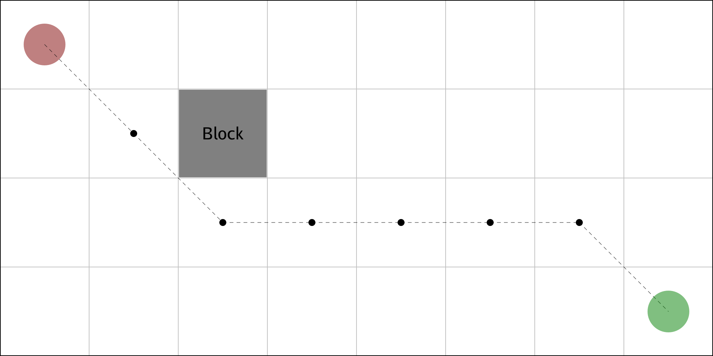
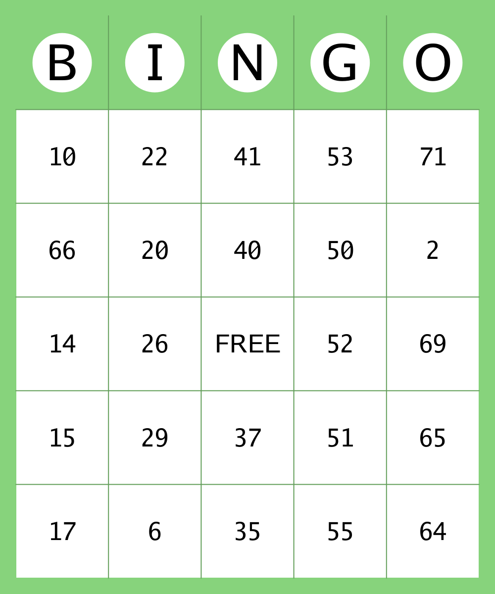
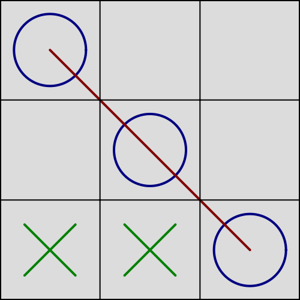

# gridder [](https://travis-ci.com/shomali11/gridder) [](https://goreportcard.com/report/github.com/shomali11/gridder) [](https://godoc.org/github.com/shomali11/gridder) [](https://opensource.org/licenses/MIT)

Built on top of Go Graphics [github.com/fogleman/gg](https://github.com/fogleman/gg) with the idea to simplify visualizing Grids using 2D Graphics.

## Dependencies

- `gg` [github.com/fogleman/gg](https://github.com/fogleman/gg)

# Install

```
go get github.com/shomali11/gridder
```

# Examples

## Example 1

Exploring the `GridConfig` configuration object. The `Rows` and `Columns` represent the rows and columns of the grid you wish to visualize. You can customize the grid by playing various options from style, color and width.

```go
package main

import (
	"image/color"
	"log"

	"github.com/shomali11/gridder"
)

func main() {
	imageConfig := gridder.ImageConfig{Name: "example1.png"}
	gridConfig := gridder.GridConfig{
		Rows:              4,
		Columns:           8,
		MarginWidth:       0,
		LineDashes:        0,
		LineStrokeWidth:   2,
		BorderDashes:      0,
		BorderStrokeWidth: 10,
		LineColor:         color.Gray{},
		BorderColor:       color.RGBA{B: 255, A: 255},
		BackgroundColor:   color.White,
	}

	grid, err := gridder.New(imageConfig, gridConfig)
	if err != nil {
		log.Fatal(err)
	}

	grid.SavePNG()
}
```


## Example 2

Exploring the `ImageConfig` configuration object. This defines the image that will be generated. You can customize the `Width` and `Height` to generate larger images.

```go
package main

import (
	"image/color"
	"log"

	"github.com/shomali11/gridder"
)

func main() {
	imageConfig := gridder.ImageConfig{
		Width:  500,
		Height: 500,
		Name:   "example2.png",
	}
	gridConfig := gridder.GridConfig{
		Rows:              4,
		Columns:           4,
		MarginWidth:       20,
		LineDashes:        10,
		LineStrokeWidth:   2,
		BorderDashes:      20,
		BorderStrokeWidth: 4,
		LineColor:         color.RGBA{R: 255 / 2, A: 255},
		BorderColor:       color.RGBA{B: 255 / 2, A: 255},
		BackgroundColor:   color.RGBA{G: 255 / 2, A: 255},
	}

	grid, err := gridder.New(imageConfig, gridConfig)
	if err != nil {
		log.Fatal(err)
	}

	grid.SavePNG()
}
```




## Example 3

Using `PaintCell` to paint a cell by the grid's row and column

```go
package main

import (
	"image/color"
	"log"

	"github.com/shomali11/gridder"
)

func main() {
	imageConfig := gridder.ImageConfig{
		Width:  500,
		Height: 500,
		Name:   "example3.png",
	}
	gridConfig := gridder.GridConfig{
		Rows:              4,
		Columns:           4,
		LineStrokeWidth:   2,
		BorderStrokeWidth: 4,
	}

	grid, err := gridder.New(imageConfig, gridConfig)
	if err != nil {
		log.Fatal(err)
	}

	grid.PaintCell(1, 2, color.Black)
	grid.SavePNG()
}
```




## Example 4

Using `DrawRectangle` to draw rectangles in cells with various stylistic properties

```go
package main

import (
	"image/color"
	"log"

	"github.com/shomali11/gridder"
)

func main() {
	imageConfig := gridder.ImageConfig{
		Width:  500,
		Height: 500,
		Name:   "example4.png",
	}
	gridConfig := gridder.GridConfig{
		Rows:              4,
		Columns:           4,
		LineStrokeWidth:   2,
		BorderStrokeWidth: 4,
	}

	grid, err := gridder.New(imageConfig, gridConfig)
	if err != nil {
		log.Fatal(err)
	}

	grid.DrawRectangle(0, 0, gridder.RectangleConfig{Width: 60, Height: 60, Color: color.Black, Stroke: true, Rotate: 45})
	grid.DrawRectangle(3, 0, gridder.RectangleConfig{Width: 60, Height: 60, Color: color.Black, Stroke: true, Rotate: 45, Dashes: 10})
	grid.DrawRectangle(0, 3, gridder.RectangleConfig{Width: 60, Height: 60, Color: color.Black, Stroke: true, StrokeWidth: 25})
	grid.DrawRectangle(2, 1, gridder.RectangleConfig{Width: 180, Height: 180, Color: color.RGBA{R: 255 / 2, A: 255 / 2}})
	grid.DrawRectangle(3, 3, gridder.RectangleConfig{Width: 60, Height: 60, Color: color.Black, Stroke: false})
	grid.SavePNG()
}
```


## Example 5

Using `DrawCircle` to draw circles in cells with various stylistic properties

```go
package main

import (
	"image/color"
	"log"

	"github.com/shomali11/gridder"
)

func main() {
	imageConfig := gridder.ImageConfig{
		Width:  500,
		Height: 500,
		Name:   "example5.png",
	}
	gridConfig := gridder.GridConfig{
		Rows:              4,
		Columns:           4,
		LineStrokeWidth:   2,
		BorderStrokeWidth: 4,
	}

	grid, err := gridder.New(imageConfig, gridConfig)
	if err != nil {
		log.Fatal(err)
	}

	grid.DrawCircle(0, 0, gridder.CircleConfig{Radius: 30, Color: color.Black, Stroke: true})
	grid.DrawCircle(3, 0, gridder.CircleConfig{Radius: 30, Color: color.Black, Stroke: true, Dashes: 10})
	grid.DrawCircle(0, 3, gridder.CircleConfig{Radius: 30, Color: color.Black, Stroke: true, StrokeWidth: 25})
	grid.DrawCircle(2, 1, gridder.CircleConfig{Radius: 90, Color: color.RGBA{R: 255 / 2, A: 255 / 2}})
	grid.DrawCircle(3, 3, gridder.CircleConfig{Radius: 30, Color: color.Black, Stroke: false})
	grid.SavePNG()
}
```




## Example 6

Using `DrawLine` to draw lines in cells with various stylistic properties

```go
package main

import (
	"image/color"
	"log"

	"github.com/shomali11/gridder"
)

func main() {
	imageConfig := gridder.ImageConfig{
		Width:  500,
		Height: 500,
		Name:   "example6.png",
	}
	gridConfig := gridder.GridConfig{
		Rows:              4,
		Columns:           4,
		MarginWidth:       30,
		LineStrokeWidth:   2,
		BorderStrokeWidth: 4,
	}

	grid, err := gridder.New(imageConfig, gridConfig)
	if err != nil {
		log.Fatal(err)
	}

	grid.DrawLine(0, 0, gridder.LineConfig{Length: 60, Color: color.Black, Dashes: 0})
	grid.DrawLine(0, 0, gridder.LineConfig{Length: 60, Color: color.Black, Dashes: 0, Rotate: 90})
	grid.DrawLine(0, 3, gridder.LineConfig{Length: 60, Color: color.Black, Dashes: 0, StrokeWidth: 25})
	grid.DrawLine(2, 1, gridder.LineConfig{Length: 90, Color: color.RGBA{R: 255 / 2, A: 255 / 2}, Rotate: 45})
	grid.DrawLine(2, 1, gridder.LineConfig{Length: 90, Color: color.RGBA{R: 255 / 2, A: 255 / 2}, Rotate: 135})
	grid.DrawLine(3, 3, gridder.LineConfig{Length: 60, Color: color.Black, Dashes: 5})
	grid.SavePNG()
}
```




## Example 7

Using `DrawPath` to draw a path between two cells with various stylistic properties

```go
package main

import (
	"image/color"
	"log"

	"github.com/shomali11/gridder"
)

func main() {
	imageConfig := gridder.ImageConfig{
		Width:  500,
		Height: 500,
		Name:   "example7.png",
	}
	gridConfig := gridder.GridConfig{
		Rows:              4,
		Columns:           4,
		LineStrokeWidth:   2,
		BorderStrokeWidth: 4,
	}

	grid, err := gridder.New(imageConfig, gridConfig)
	if err != nil {
		log.Fatal(err)
	}

	grid.DrawPath(0, 0, 1, 1, gridder.PathConfig{Dashes: 0, StrokeWidth: 10, Color: color.Black})
	grid.DrawPath(1, 1, 2, 1, gridder.PathConfig{Dashes: 5, StrokeWidth: 1, Color: color.Black})
	grid.DrawPath(2, 1, 3, 1, gridder.PathConfig{Dashes: 8, StrokeWidth: 1, Color: color.Black})
	grid.DrawPath(3, 1, 3, 2, gridder.PathConfig{Dashes: 0, StrokeWidth: 1, Color: color.Black})
	grid.SavePNG()
}
```




## Example 8

Using `DrawString` to draw a string in a cell with various stylistic properties

```go
package main

import (
	"image/color"
	"log"

	"github.com/golang/freetype/truetype"
	"github.com/shomali11/gridder"
	"golang.org/x/image/font/gofont/goregular"
)

func main() {
	imageConfig := gridder.ImageConfig{
		Width:  500,
		Height: 500,
		Name:   "example8.png",
	}
	gridConfig := gridder.GridConfig{
		Rows:              4,
		Columns:           4,
		LineStrokeWidth:   2,
		BorderStrokeWidth: 4,
	}

	grid, err := gridder.New(imageConfig, gridConfig)
	if err != nil {
		log.Fatal(err)
	}

	font, err := truetype.Parse(goregular.TTF)
	if err != nil {
		log.Fatal(err)
	}

	fontFace1 := truetype.NewFace(font, &truetype.Options{Size: 24})
	fontFace2 := truetype.NewFace(font, &truetype.Options{Size: 35})

	grid.DrawString(0, 0, "Hello!", fontFace1)
	grid.DrawString(1, 1, "Hello!", fontFace1, gridder.StringConfig{Rotate: 45})
	grid.DrawString(2, 2, "Hello!", fontFace2, gridder.StringConfig{Color: color.RGBA{B: 255 / 2, A: 255 / 2}})
	grid.SavePNG()
}
```




## Example 9

Combining multiple features to draw the shortest path on a grid

```go
package main

import (
	"image/color"
	"log"

	"github.com/golang/freetype/truetype"
	"github.com/shomali11/gridder"
	"golang.org/x/image/font/gofont/goregular"
)

func main() {
	imageConfig := gridder.ImageConfig{
		Width:  2000,
		Height: 1000,
		Name:   "example9.png",
	}
	gridConfig := gridder.GridConfig{
		Rows:              4,
		Columns:           8,
		MarginWidth:       32,
		LineStrokeWidth:   2,
		BorderStrokeWidth: 20,
	}

	grid, err := gridder.New(imageConfig, gridConfig)
	if err != nil {
		log.Fatal(err)
	}

	font, err := truetype.Parse(goregular.TTF)
	if err != nil {
		log.Fatal(err)
	}

	fontFace := truetype.NewFace(font, &truetype.Options{Size: 48})

	lineConfig := gridder.PathConfig{Dashes: 10}
	circleConfig := gridder.CircleConfig{Color: color.Gray{}, Radius: 10}

	grid.PaintCell(1, 2, color.NRGBA{R: 0, G: 0, B: 0, A: 255 / 2})
	grid.DrawString(1, 2, "Block", fontFace)

	grid.DrawCircle(0, 0, gridder.CircleConfig{Color: color.NRGBA{R: 255 / 2, G: 0, B: 0, A: 255 / 2}, Radius: 60})
	grid.DrawPath(0, 0, 1, 1, lineConfig)
	grid.DrawCircle(1, 1, circleConfig)
	grid.DrawPath(1, 1, 2, 2, lineConfig)
	grid.DrawCircle(2, 2, circleConfig)
	grid.DrawPath(2, 2, 2, 3, lineConfig)
	grid.DrawCircle(2, 3, circleConfig)
	grid.DrawPath(2, 3, 2, 4, lineConfig)
	grid.DrawCircle(2, 4, circleConfig)
	grid.DrawPath(2, 4, 2, 5, lineConfig)
	grid.DrawCircle(2, 5, circleConfig)
	grid.DrawPath(2, 5, 2, 6, lineConfig)
	grid.DrawCircle(2, 6, circleConfig)
	grid.DrawPath(2, 6, 3, 7, lineConfig)
	grid.DrawCircle(3, 7, gridder.CircleConfig{Color: color.NRGBA{R: 0, G: 255 / 2, B: 0, A: 255 / 2}, Radius: 60})

	grid.SavePNG()
}
```




## Example 10

Combining multiple features to draw a Bingo card

```go
package main

import (
	"image/color"
	"log"

	"github.com/golang/freetype/truetype"
	"github.com/shomali11/gridder"
	"golang.org/x/image/font/gofont/goregular"
)

func main() {
	imageConfig := gridder.ImageConfig{
		Width:  1000,
		Height: 1200,
		Name:   "example10.png",
	}
	gridConfig := gridder.GridConfig{
		Rows:            6,
		Columns:         5,
		MarginWidth:     32,
		LineStrokeWidth: 2,
		BackgroundColor: color.RGBA{R: 135, G: 211, B: 124, A: 255},
	}

	grid, err := gridder.New(imageConfig, gridConfig)
	if err != nil {
		log.Fatal(err)
	}

	font, err := truetype.Parse(goregular.TTF)
	if err != nil {
		log.Fatal(err)
	}

	headerFontFace := truetype.NewFace(font, &truetype.Options{Size: 100})
	valueFontFace := truetype.NewFace(font, &truetype.Options{Size: 50})

	headers := []string{"B", "I", "N", "G", "O"}
	values := [][]string{
		{"10", "22", "41", "53", "71"},
		{"66", "20", "40", "50", "2"},
		{"14", "26", "FREE", "52", "69"},
		{"15", "29", "37", "51", "65"},
		{"17", "6", "35", "55", "64"},
	}

	circleConfig := gridder.CircleConfig{Radius: 60, Color: color.White}
	for i, header := range headers {
		grid.DrawCircle(0, i, circleConfig)
		grid.DrawString(0, i, header, headerFontFace)
	}

	for row := range values {
		for column := range values[0] {
			grid.PaintCell(row+1, column, color.White)
			grid.DrawString(row+1, column, values[row][column], valueFontFace)
		}
	}
	grid.SavePNG()
}
```




## Example 11

Combining multiple features to draw a Tic Tac Toe game

```go
package main

import (
	"image/color"
	"log"

	"github.com/shomali11/gridder"
)

func main() {
	imageConfig := gridder.ImageConfig{
		Width:  500,
		Height: 500,
		Name:   "example11.png",
	}
	gridConfig := gridder.GridConfig{
		Rows:              3,
		Columns:           3,
		LineStrokeWidth:   2,
		BorderStrokeWidth: 4,
		LineColor:         color.Gray{},
		BorderColor:       color.Gray{},
		BackgroundColor:   color.NRGBA{R: 220, G: 220, B: 220, A: 255},
	}

	grid, err := gridder.New(imageConfig, gridConfig)
	if err != nil {
		log.Fatal(err)
	}

	blue := color.RGBA{B: 128, A: 255}
	green := color.RGBA{G: 128, A: 255}

	grid.DrawCircle(0, 0, gridder.CircleConfig{Radius: 60, Color: blue, StrokeWidth: 4, Stroke: true})
	grid.DrawCircle(1, 1, gridder.CircleConfig{Radius: 60, Color: blue, StrokeWidth: 4, Stroke: true})
	grid.DrawCircle(2, 2, gridder.CircleConfig{Radius: 60, Color: blue, StrokeWidth: 4, Stroke: true})
	grid.DrawLine(2, 0, gridder.LineConfig{Length: 120, Color: green, StrokeWidth: 4, Rotate: 45})
	grid.DrawLine(2, 0, gridder.LineConfig{Length: 120, Color: green, StrokeWidth: 4, Rotate: 135})
	grid.DrawLine(2, 1, gridder.LineConfig{Length: 120, Color: green, StrokeWidth: 4, Rotate: 45})
	grid.DrawLine(2, 1, gridder.LineConfig{Length: 120, Color: green, StrokeWidth: 4, Rotate: 135})
	grid.DrawPath(0, 0, 2, 2, gridder.PathConfig{StrokeWidth: 4, Color: color.RGBA{R: 128, A: 255}})
	grid.SavePNG()
}
```


